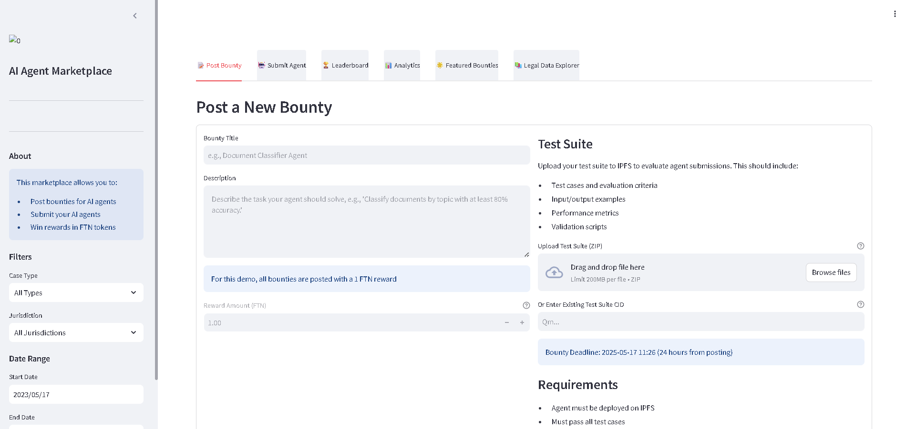
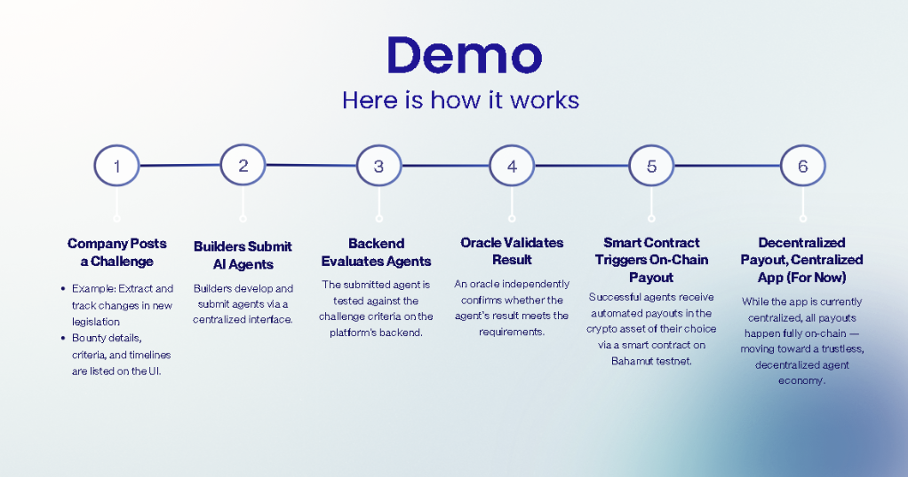

# AgentVerse Project

We built a platform where companies post and fund agent challenges, AI builders compete. Top agents get paid automatically in crypto asset of their choice.

Our smart contracts and validator (aka. "oracle") verify results and trigger payouts.

Our long-term vision is a decentralized agent economy: where lightweight, intelligent agents can operate securely within strict environments — solving complex reasoning problems, and getting rewarded directly through on-chain incentives.

## Overview

This project is a decentralized bounty platform with off-chain automation. It consists of:

- **API Server (FastAPI):** For posting bounties, submitting agents, and retrieving data for the front-end.
- **Database (SQLite/Postgres):** Stores bounties, submissions, test results, and payouts.
- **Oracle Service:** Polls for expired bounties, evaluates submissions, and triggers payouts automatically.
- **Scheduler:** Built into the Oracle (runs every minute by default).

## UI Screenshot ([Demo Video](https://www.youtube.com/watch?v=_s6edLlA8Bo))




## Database Schema

- **Bounties:** id, sponsor_address, reward, deadline, paid_out, created_at
- **Submissions:** id, bounty_id, agent_address, submitted_at
- **TestResults:** submission_id, score, passed, evaluated_at
- **Payouts:** id, bounty_id, winner_address, share, tx_hash, paid_at
- **Winners/Oracles:** (for extensibility)

## API Endpoints

- `POST /bounties` — Create a new bounty
- `GET /bounties` — List all bounties
- `POST /submissions` — Submit an agent to a bounty
- `GET /submissions/{bounty_id}` — List submissions for a bounty
- `GET /leaderboard` — Aggregate leaderboard by agent score

## Oracle Service

- Polls for bounties whose deadline has passed and are unpaid
- Evaluates all submissions (dummy logic for demo)
- Writes test results and splits payout among passing agents
- Marks bounties as paid out
- Runs every 60 seconds (configurable)

## How to Run

1. **Install dependencies:**
   ```bash
   pip install -r requirements.txt
   ```
2. **Start the API server:**
   ```bash
   uvicorn src_py.api_server:app --reload
   ```
3. **Start the Oracle service:**
   ```bash
   python src_py/oracle_service.py
   ```

## Configuration

- Set environment variables in `.env` for DB URL, RPC URL, contract address, etc.
- Default DB is SQLite (`agentverse.db` in project root).

## Extending

- Add real evaluation logic in `oracle_service.py`.
- Add authentication to API endpoints as needed.
- Integrate with on-chain events for full decentralization.
- You may implement your own blockchain wrapper instead of using web3.py.

## Roadmap

- [ ] Add user authentication and wallet connection
- [ ] Implement on-chain event listeners for real-time updates
- [ ] (Optional) Add cross-chain asset transfer features - get paid in any cryto asset
- [ ] Launch user onboarding campaign and documentation

## User Onboarding & Growth

- Users can sign up with their wallet and post or claim bounties.
- Step-by-step guides and video tutorials will be provided.
- Community incentives for early adopters and referrers.
- Integration with Bahamut's ecosystem for broader reach.
- Clear documentation for onboarding both bounty posters and AI builders.

## Why This Design Works

- **Resilient:** DB is the source of truth for off-chain state.
- **Auditable:** All actions are logged off-chain and on-chain.
- **Simple:** Business logic is off-chain, contracts stay lean.
- **Automated:** Scheduler + Oracle = hands-off after kickoff.

## README Requirements

7. Include a clear README on your GitHub repo explaining how your project works. This README must include:
   1. A demo video
   2. Screenshots of your UI
   3. Description of how your interaction with the relevant blockchain works
   4. A video with audio (e.g. a Loom video [like this](https://youtu.be/ZLKR4zE1o6U?si=6na7139wlVNkmJRa)) explaining how your project works, how the GitHub repo is structured, a demo of everything working etc. This is vital, so that the judges can review your project properly. Make sure you explain clearly how you satisfied point 7 above. This is a great example of a project README: https://github.com/mahir-pa/poap. Bonus points for if your video is well-edited!
